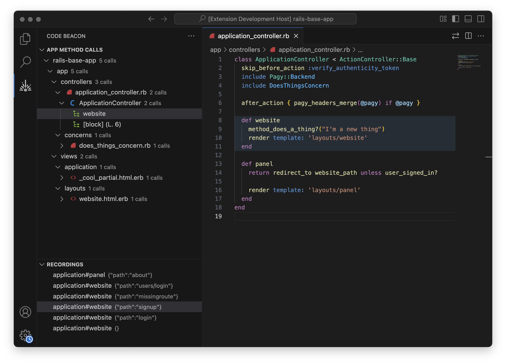

# Code Beacon

Code Beacon is a Visual Studio Code extension that helps you reason about recently executed Ruby code and navigate between relevant files and methods. A file explorer-like view is presented that filters out all of the noise and only shows you the files for one of your code flows. Drilling down into each file provides a list of methods and blocks that were traced for a given recording.

This extension is only part of the entire offering and requires the codebeacon-tracer gem to be installed and configured to record. See installation below.

> ⚠️ **Pre-release Warning**: This is a pre-release version of Code Beacon. While core functionality exists and may provide utility, you may encounter significant bugs or issues and frequent breaking changes. Testing is currently limited, and the UI and future direction may change. We appreciate your feedback and bug reports as we work towards a stable release.



## Installation

1. Open VS Code
2. Go to Extensions (Ctrl+Shift+X)
3. Search for "Code Beacon"
4. Click Install

## Requirements

- Visual Studio Code 1.85.0 or higher
- Ruby 2.7 or higher
- A Ruby project with the Code Beacon gem installed
- SQLite3 binary (sqlite3) installed on your system
  - Mac: Available via Homebrew (`brew install sqlite3`)
  - Linux: Available via package manager (e.g., `apt install sqlite3`)
  - Windows: Download from the [SQLite website](https://www.sqlite.org/download.html)

> **Note**: Code Beacon requires the SQLite3 command-line binary to be installed and configured. During initial setup, the extension will attempt to automatically detect the SQLite3 binary on your system. If it cannot be found, you will be prompted to provide the path manually.

## Getting Started

1. Install the Code Beacon gem in your Ruby project:
   ```
   gem install codebeacon_tracer
   ```
   
   Or add to your Gemfile:
   ```ruby
   gem 'codebeacon_tracer'
   ```

2. Add the Code Beacon tracer to your Ruby application:

   ```ruby
   require 'codebeacon_tracer'

   # Trace a block of code
   CodeBeacon::Tracer.trace("My Trace", "Description of what I'm tracing") do |tracer|
     # Your code to analyze goes here
     some_method_to_analyze
   end

   # Or start and stop tracing manually
   CodeBeacon::Tracer.start
   # Your code to analyze
   some_method_to_analyze
   CodeBeacon::Tracer.stop
   ```

   **Rails Applications**: In Rails applications, HTTP requests are automatically traced without any additional code. Simply install the gem and run your Rails server as usual.

3. Run your application to generate execution data
4. Open the Code Beacon panel in VS Code (look for the beacon icon in the activity bar)
5. Browse through the recorded method calls and execution paths

## Extension Settings

This extension contributes the following settings:

* `code-beacon.dataDir`: Set the root directory name for the data files in the workspace root (default: `.code-beacon`)
* `code-beacon.rootDir`: Used only in the case of a multi-root workspace. Enable a single root directory by setting its path here.

## Known Issues

- Currently only supports Ruby applications
- Large applications with many method calls may experience performance issues
   - This is especially true on initial load or reload of a rails application.
   - The first request after a rails server is started is not traced.

## Release Notes

### 0.1.0

- Initial release of Code Beacon
- Method call visualization
- Recording management

## License

This extension is licensed under the [MIT License](LICENSE.md).

---

## Attributions

### Icons

- <a href="https://www.flaticon.com/free-icons/laser" title="laser icons">Laser icons created by Freepik - Flaticon</a>
- This extension uses icons from the [Material Design Icon Theme](https://github.com/material-extensions/vscode-material-icon-theme) by Material Extensions, licensed under the [MIT License](https://github.com/material-extensions/vscode-material-icon-theme/blob/main/LICENSE).
